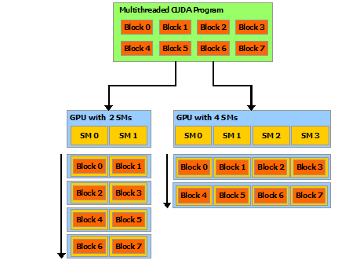

<style>
/* ---- helper styles for this deck (NVIDIA theme palette) ---- */
section { font-size: 25px; }

/* source caption under borrowed figures */
.src { display:block; font-size:0.6em; color:var(--nv-grey-light); margin-top:6px; }
.center { text-align:center; }
.center img { border-radius:8px; }

/* layered stack diagram */
.stack { display: flex; flex-direction: column; gap: 5px; margin: 0.3em 0; }
.layer {
  padding: 8px 16px; border-radius: 6px; font-weight: 700; font-size: 0.92em;
  border-left: 6px solid var(--nv-green); background: #f4f8ec; color: var(--nv-black);
}
.layer small { display: block; font-weight: 400; color: var(--nv-grey); font-size: 0.66em; }
.layer.host { background: #eef0f2; border-left-color: var(--nv-grey); }
.layer.hw   { background: #000; color: #fff; border-left-color: var(--nv-green); }
.layer.hw small { color: var(--nv-grey-light); }

/* pills / tags */
.pill { display:inline-block; padding:2px 10px; border-radius:999px; font-size:0.7em;
  font-weight:700; background:var(--nv-green); color:#fff; }
.pill.grey { background:var(--nv-grey); }
.muted { color: var(--nv-grey); }

/* card grids */
.cards  { display:grid; grid-template-columns:1fr 1fr; gap:12px; margin-top:0.4em; }
.cards3 { display:grid; grid-template-columns:repeat(3,1fr); gap:12px; margin-top:0.5em; }
.card  { background:#f6f7f8; border-radius:8px; padding:10px 16px; border-top:4px solid var(--nv-green); }
.card h3 { margin:0 0 3px; color:var(--nv-black); }
.card p  { margin:0; font-size:0.8em; color:var(--nv-grey); }

/* horizontal flow */
.flow { display:flex; align-items:center; gap:7px; flex-wrap:wrap; margin-top:0.4em; font-weight:700; }
.flow .step { background:#f4f8ec; border:1px solid var(--nv-green); border-radius:6px; padding:6px 12px; }
.flow .arrow { color:var(--nv-green); font-weight:700; }

/* "few vs many cores" infographic */
.coresrow { display:flex; gap:60px; justify-content:center; align-items:center; margin-top:0.5em; }
.corebox { text-align:center; }
.corebox .cap { font-weight:700; margin-bottom:8px; }
.cpu-grid { display:grid; grid-template-columns:repeat(2,52px); gap:10px; justify-content:center; }
.cpu-grid div { height:52px; background:var(--nv-grey); border-radius:7px; }
.gpu-grid { display:grid; grid-template-columns:repeat(14,15px); gap:3px; }
.gpu-grid div { height:15px; background:var(--nv-green); border-radius:2px; }

/* CPU/GPU memory + narrow link infographic */
.xfer { display:flex; align-items:center; justify-content:center; gap:0; margin-top:0.5em; }
.dev { border:2px solid var(--nv-grey-light); border-radius:10px; padding:14px 18px; width:250px; text-align:center; }
.dev.gpu { border-color:var(--nv-green); }
.dev .name { font-weight:700; }
.dev .hw { margin-top:8px; height:13px; border-radius:7px; background:var(--nv-green); }
.dev .cap { font-size:0.66em; color:var(--nv-grey); margin-top:5px; }
.link { width:120px; text-align:center; color:var(--nv-grey); font-size:0.66em; }
.link .thin { height:4px; background:var(--nv-grey); margin:6px 10px; border-radius:2px; }

/* sequential vs parallel timeline */
.tl { display:flex; gap:70px; justify-content:center; margin-top:0.5em; }
.tlcol { text-align:center; }
.tlcol .h { font-weight:700; margin-bottom:10px; }
.seqbar { display:flex; gap:3px; }
.seqbar div { width:13px; height:20px; background:var(--nv-grey); border-radius:2px; }
.parstack { display:flex; flex-direction:column; gap:4px; align-items:center; }
.parstack div { width:55px; height:9px; background:var(--nv-green); border-radius:2px; }
.tlcol .t { font-size:0.66em; color:var(--nv-grey); margin-top:8px; }

/* kernels -> one Python call infographic */
.kernwrap { display:flex; align-items:center; justify-content:center; gap:24px; margin-top:0.4em; }
.kernels { display:flex; flex-wrap:wrap; gap:6px; max-width:600px; }
.kernels span { background:#f4f8ec; border:1px solid var(--nv-green); border-radius:5px; padding:4px 9px; font-size:0.7em; font-weight:600; color:var(--nv-black); }
.bigarrow { color:var(--nv-green); font-weight:800; font-size:1.7em; }
.callbox { border:2px solid var(--nv-green); border-radius:10px; padding:16px 18px; text-align:center; font-weight:700; width:185px; }
.callbox small { display:block; font-weight:400; color:var(--nv-grey); font-size:0.7em; margin-top:4px; }
</style>

<!-- _class: title -->
<!-- _paginate: false -->

# Understanding GPUs
## From the *device* to *RAPIDS* : how the pieces fit together

**Jaya Venkatesh and Naty Clementi · NVIDIA**
SciPy 2026 · GPU Deployment & Debugging Tutorial ·

---

# Why bring data science to the GPU?

<div class="cards3">
  <div class="card"><h3>Bigger data</h3><p>Datasets keep outgrowing what's comfortable on a CPU</p></div>
  <div class="card"><h3>Parallel by nature</h3><p>Filtering, aggregating, and math over millions of rows are independent</p></div>
  <div class="card"><h3>Familiar APIs</h3><p>You can get there without leaving Python</p></div>
</div>

<br>

> But how does a GPU actually **help you accelerate your code?**

---

<!-- _class: section -->

# 1 · The GPU vs the CPU
> Both process data, just with a different philosophy

---

# A CPU and a GPU are built for different jobs

<div class="center">

<span class="src">Source: NVIDIA CUDA C++ Programming Guide</span>
</div>

<div class="columns">
<div>

**CPU**: handles **many different tasks**, finishing **each one fast** → *low latency*.

</div>
<div>

**GPU**: runs the **same task across lots of data** all at once → *high throughput*.

</div>
</div>

---

# A few specialists vs many simple workers

<div class="coresrow">
<div class="corebox"><div class="cap">CPU</div>
<div class="cpu-grid"><div></div><div></div><div></div><div></div></div>
<div class="muted" style="font-size:0.7em; margin-top:8px;">a few powerful cores</div>
</div>
<div class="corebox"><div class="cap">GPU</div>
<div class="gpu-grid">
<div></div><div></div><div></div><div></div><div></div><div></div><div></div><div></div><div></div><div></div><div></div><div></div><div></div><div></div>
<div></div><div></div><div></div><div></div><div></div><div></div><div></div><div></div><div></div><div></div><div></div><div></div><div></div><div></div>
<div></div><div></div><div></div><div></div><div></div><div></div><div></div><div></div><div></div><div></div><div></div><div></div><div></div><div></div>
<div></div><div></div><div></div><div></div><div></div><div></div><div></div><div></div><div></div><div></div><div></div><div></div><div></div><div></div>
<div></div><div></div><div></div><div></div><div></div><div></div><div></div><div></div><div></div><div></div><div></div><div></div><div></div><div></div>
</div>
<div class="muted" style="font-size:0.7em; margin-top:8px;">many simple cores</div>
</div>
</div>

- CPU cores are **few but powerful**, great at complex, branchy logic
- GPU cores are **many but simple**, built to all do the **same operation** on different data, together
- The more your work splits into **independent pieces**, the more **using the GPU pays off**

---

# Two machines, two separate memories

<div class="xfer">
<div class="dev"><div class="name">CPU</div><div class="cap" style="font-size:0.84em; margin-top:12px;">System RAM<br>large, general-purpose</div></div>
<div class="link" style="font-weight:700; color:var(--nv-grey);">must copy<br>data across →</div>
<div class="dev gpu"><div class="name">GPU</div><div class="cap" style="font-size:0.84em; margin-top:12px;">VRAM<br>its own dedicated memory</div></div>
</div>

<br>

- The GPU is a **separate device** with its **own memory**: it **cannot** read data sitting in system RAM
- Before the GPU can work on your data, that data must be **copied into the GPU's memory**

> So step one of "run it on the GPU" is always: **get the data there.**

---

# The slow part is getting data *across*

<style scoped>
.dev .hw { height: 24px; }
.link { width: 150px; }
.link .thin { height: 2px; margin: 8px 12px; }
</style>

<div class="xfer">
<div class="dev"><div class="name">CPU + RAM</div><div class="hw" style="background:var(--nv-grey);"></div><div class="cap">high memory bandwidth</div></div>
<div class="link">PCIe<div class="thin"></div>lower bandwidth</div>
<div class="dev gpu"><div class="name">GPU + VRAM</div><div class="hw"></div><div class="cap">high memory bandwidth</div></div>
</div>

<br>

- **Inside** each device, **memory bandwidth is high**: RAM and VRAM are built to feed their cores fast
- The **interconnect between them (PCIe)** carries data at **far lower bandwidth**
- The expensive part often isn't the *computing*; it's the **host-to-device transfer** across PCIe

---

<!-- _class: section -->

# 2 · How a GPU processes data
> Many small tasks at once, not one big task in order

---

# Parallel work: threads, blocks, grids

The GPU runs **one operation across thousands of elements at once**, one **thread** per item.

<div class="center">

<span class="src">Source: NVIDIA CUDA C++ Programming Guide</span>
</div>

- Threads are grouped into **blocks**; blocks together form a **grid**
- You describe the work *once*; the GPU runs it across the **whole grid in parallel**
- Perfect for **independent** work, not optimal for **sequential**, step-by-step logic

---

# Why GPU is better for parallel than sequential

<div class="tl">
<div class="tlcol"><div class="h">Sequential</div>
<div class="seqbar"><div></div><div></div><div></div><div></div><div></div><div></div><div></div><div></div><div></div><div></div><div></div><div></div><div></div><div></div></div>
<div class="t">one after another → time →</div>
</div>
<div class="tlcol"><div class="h">Parallel</div>
<div class="parstack"><div></div><div></div><div></div><div></div><div></div><div></div><div></div><div></div></div>
<div class="t">all at once → done sooner</div>
</div>
</div>

<br>

- When work items are **independent**, their order doesn't matter: item B doesn't need item A's result
- A GPU runs a **huge number of independent items at the same time**
- Step-by-step work that must run **in order** can't use that; this isn't where a GPU shines

---

# SMs and warps: where the work runs

<div class="columns">
<div>

- A GPU is made of **Streaming Multiprocessors (SMs)**, its parallel engines
- Your **blocks are distributed across the SMs**; more SMs → more work at once, **automatically**
- Inside an SM, threads run in lock-step groups of **32, called a warp** *(SIMT: Single Instruction, Multiple Threads)*

</div>
<div class="center">

<span class="src">Source: NVIDIA CUDA C++ Programming Guide</span>
</div>
</div>

---

# Compute-bound vs IO-bound

<div class="columns">
<div>

### ✓ Compute-bound: GPU shines
- A matrix multiply, training a model, transforming millions of rows
- **Lots of math** → the cores stay saturated

</div>
<div>

### ✗ IO-bound: GPU waits
- Reading a file off disk, waiting on a network call
- The bottleneck is **waiting**, not math

</div>
</div>

<br>

> Adding compute units only helps when **computation** is the bottleneck. If you're waiting on data, more cores don't make the wait shorter.

---

# So what actually fits a GPU?

<div class="cards">
  <div class="card"><h3>✓ Parallel</h3><p>The same operation over millions of elements</p></div>
  <div class="card"><h3>✗ Sequential</h3><p>Each step depends on the previous one</p></div>
  <div class="card"><h3>✓ Compute-bound</h3><p>Lots of math per byte of data</p></div>
  <div class="card"><h3>✗ IO-bound</h3><p>Time spent waiting on disk / network</p></div>
</div>

> Takeaway: a GPU shines on **big, math-heavy, parallel** work, so the goal is to match your workload to its strengths.

---

<!-- _class: section -->

# 3 · CUDA
> The bridge that lets software use the GPU

---

# What is CUDA, and why C?

<style scoped>
section { padding-top: 30px; padding-bottom: 22px; }
</style>

<div class="columns">
<div>

**CUDA** is NVIDIA's parallel-computing **platform + programming model**, built on **C/C++** for its low-level speed and control over the hardware.

- You write GPU code as **kernels** in **CUDA C/C++**: standard C/C++ plus a few extensions, compiled by `nvcc`
- The **host** (CPU) runs serial code and **launches kernels** on the **device** (GPU)
- Serial host code and parallel kernels **alternate** (see diagram →)

</div>
<div class="center">

<span class="src">Source: NVIDIA CUDA C++ Programming Guide</span>
</div>
</div>

---

# A CUDA kernel is just C, with a twist

```cpp
// __global__ marks a function that runs ON the GPU, once per thread
__global__ void add(float *a, float *b, float *c) {
    int i = blockIdx.x * blockDim.x + threadIdx.x;  // which element am I?
    c[i] = a[i] + b[i];                             // one thread, one element
}

// The host launches it across a grid:  <<< blocks, threads-per-block >>>
add<<<blocks, threads>>>(a, b, c);   // every element added in parallel
```

> The `__global__` keyword and the `<<< >>>` launch syntax are the **C extensions** CUDA adds. A sum, a sort, a join all become kernels like this, but **you'll rarely write one**: the layers above ship them ready-made.

---

<!-- _class: section -->

# 4 · CUDA Python & the CUDA Toolkit
> The building blocks above raw CUDA

---

# The CUDA Toolkit: the foundation libraries

Everything above the driver is **built on the Toolkit**. It provides:

<div class="cards">
  <div class="card"><h3>Compiler &amp; runtime</h3><p>nvcc, libcudart, headers</p></div>
  <div class="card"><h3>Math libraries</h3><p>cuBLAS, cuFFT, cuSPARSE, cuSOLVER, cuRAND</p></div>
  <div class="card"><h3>Communication</h3><p>NCCL, NVSHMEM for multi-GPU</p></div>
  <div class="card"><h3>Why it's central</h3><p>cuDF, cuML &amp; CuPy don't reinvent math, they call these</p></div>
</div>

> These hand-tuned libraries are the **ready-made kernels**: the sorts, joins, and math behind your data work come straight from here.

---

# CUDA Python: pick the right door

You don't have to write C++ to use CUDA. Match the door to the need:

<div class="cards3">
  <div class="card"><h3>CuPy</h3><p>"I have NumPy code" → swap in GPU arrays</p></div>
  <div class="card"><h3>Numba (CUDA)</h3><p>"I need a custom kernel" → write it in Python</p></div>
  <div class="card"><h3>cuda.core / cuda.bindings</h3><p>"I'm building a library / need low-level control"</p></div>
</div>

<br>

> All three reach the **same CUDA underneath**. RAPIDS sits on top of them, so most of the time you won't pick a door at all.

---

<!-- _class: section -->

# 5 · RAPIDS & CUDA-X
> Predefined kernels for data science

---

# CUDA-X & RAPIDS: kernels you don't have to write

<div class="cards">
  <div class="card"><h3>CUDA-X</h3><p>NVIDIA's library collection on top of CUDA: math, deep learning (cuDNN, TensorRT), comms, data science</p></div>
  <div class="card"><h3>RAPIDS</h3><p>The <b>data-science slice</b> of CUDA-X, open-source, with familiar Python APIs</p></div>
</div>

RAPIDS packages thousands of **optimized GPU kernels** behind APIs you already know:

| You already know | RAPIDS gives you | for |
|---|---|---|
| `pandas` · `scikit-learn` · `NumPy` · `NetworkX` | **cuDF** · **cuML** · **CuPy** · **cuGraph** | dataframes · ML · arrays · graphs |

---

# You stand on thousands of tuned kernels

<div class="kernwrap">
<div class="kernels">
<span>sort</span><span>join</span><span>group-by</span><span>filter</span><span>matmul</span><span>FFT</span><span>reduce</span><span>scan</span><span>k-means</span><span>PCA</span><span>random</span><span>SVD</span><span>rolling</span><span>histogram</span>
</div>
<div class="bigarrow">→</div>
<div class="callbox">one Python call<small>cuDF · cuML · CuPy</small></div>
</div>

<br>

- Each tile is a **GPU kernel** that experts wrote and tuned over years
- RAPIDS bundles them behind the **APIs you already know**
- You write familiar Python; **RAPIDS runs the CUDA for you**

> *How much* faster on real data? You'll **measure that yourself in Section 4.**

---

# Putting it all together

<style scoped>
h1 { font-size: 1.5em; margin-bottom: 0.1em; }
section { padding-top: 26px; padding-bottom: 26px; }
</style>

<div class="stack">
  <div class="layer">Your code &amp; notebooks <small>pandas, scikit-learn, NumPy, your scripts</small></div>
  <div class="layer">RAPIDS <small>cuDF · cuML · cuGraph, the data-science slice of CUDA-X</small></div>
  <div class="layer">CUDA Python <small>cuda.core · cuda.bindings · Numba · CuPy</small></div>
  <div class="layer">CUDA-X + CUDA Toolkit <small>cuBLAS · cuSPARSE · NCCL · libcudart · nvcc</small></div>
  <div class="layer host">NVIDIA driver <small>libcuda, the system layer that talks to the hardware</small></div>
  <div class="layer hw">GPU hardware <small>SMs · warps · thousands of cores · VRAM</small></div>
</div>

> Each layer builds on the one below it; your Python sits at the very top.

---

# The mental model for today

- A GPU is **many simple cores + its own fast memory** → built for **parallel, math-heavy** work
- Getting data **onto** the GPU is the slow part → **keep it there**
- **CUDA** (C-based) exposes that power, but you rarely touch it
- **CUDA Python** and the **CUDA Toolkit** are the building blocks
- **RAPIDS / CUDA-X** hand you **ready-made kernels**, so familiar Python code just runs on the GPU

---

<!-- _class: title -->
<!-- _paginate: false -->

# Next: let's get on a GPU
