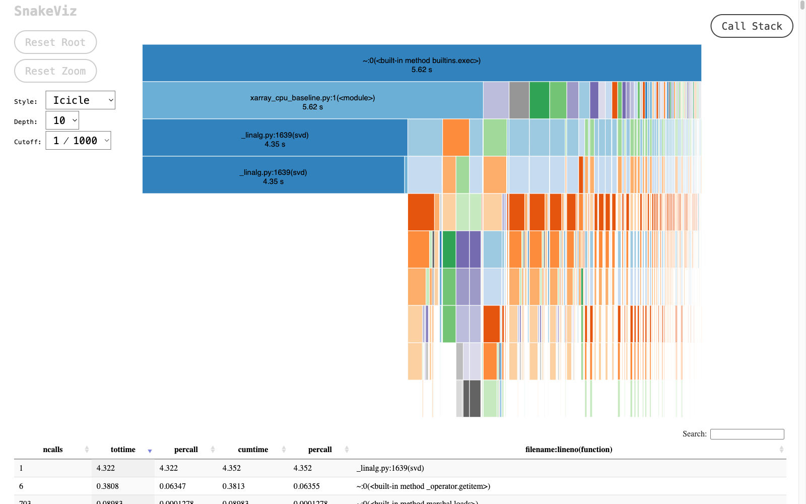
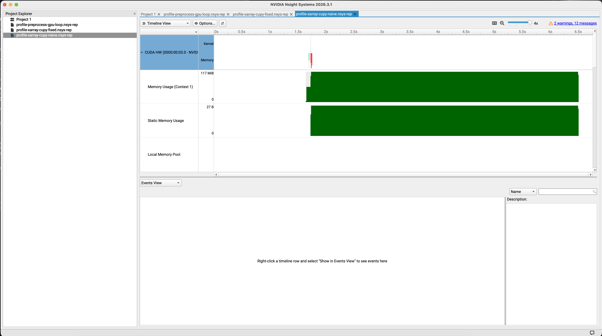
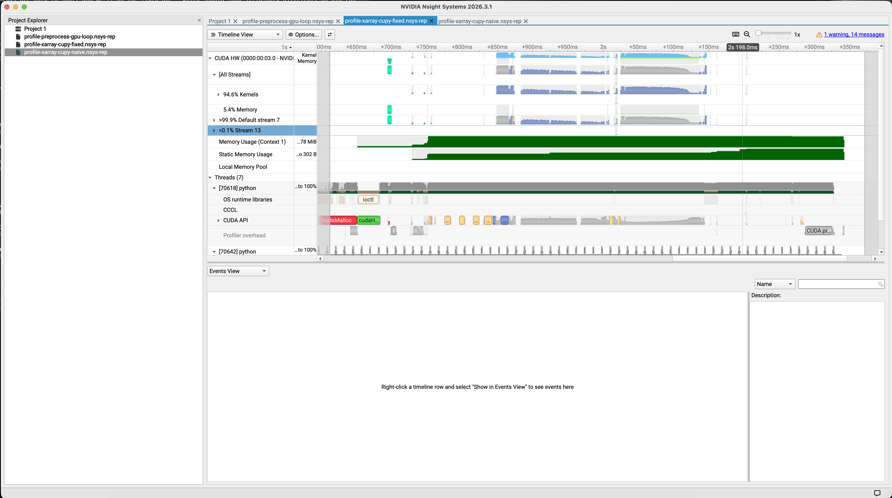
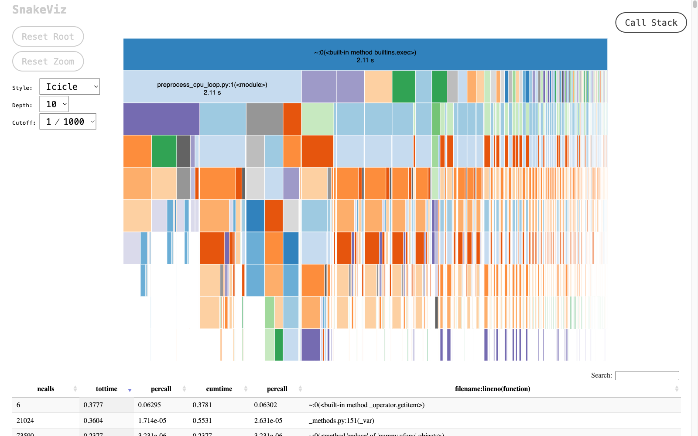
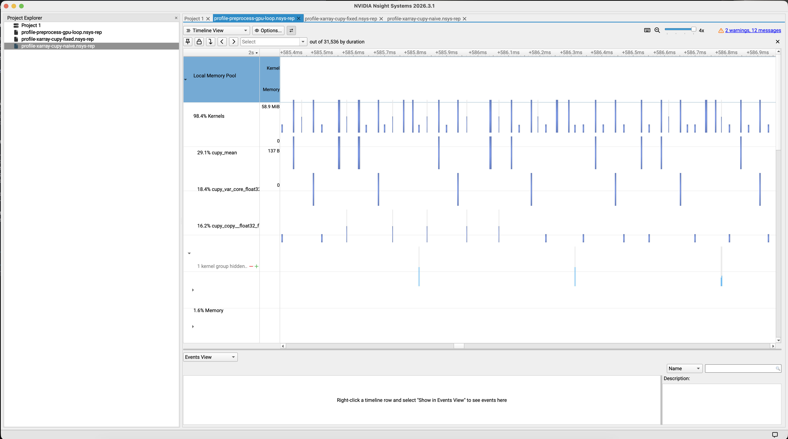

# Monitoring and Debugging GPU Python Workloads

Moving a Python workload onto a GPU doesn't automatically make the full workflow faster in some scenarios. The GPU can execute parallel work very quickly, but the workflow still has overheads for cold starts, data movement, Python overhead, synchronization, and any CPU-only stages left in the path. If your GPU code runs but doesn't get the speedup you expected, or if the GPU looks idle while the program is busy, the cause is almost always one of those costs rather than the GPU itself.

This section gives you the tools to diagnose those overheads and fix them. We'll use terminal monitoring tools, Python profilers, and GPU timeline traces to answer one question: which part of this workflow is the limiter, and how do we make it faster?

To keep it concrete, we'll follow a single workload from start to finish. We'll take a year of global temperature data, run a standard analysis on it, port that analysis to the GPU, watch it underperform, and use each tool in turn to find and fix the bottleneck. Every tool we introduce answers a question the previous one couldn't.

## Before we run Python code

Start where every GPU debugging session should start: the VM.

```bash
nvidia-smi
```

On a working VM you should see a table with the GPU name, driver version, the CUDA version reported by the driver, memory usage, utilization, and a process table. On a Brev VM with an L4 it looks something like this:

```console
$ nvidia-smi
+-----------------------------------------------------------------------------------------+
| NVIDIA-SMI 580.159.03             Driver Version: 580.159.03     CUDA Version: 13.0     |
+-----------------------------------------+------------------------+----------------------+
| GPU  Name                 Persistence-M | Bus-Id          Disp.A | Volatile Uncorr. ECC |
| Fan  Temp   Perf          Pwr:Usage/Cap |           Memory-Usage | GPU-Util  Compute M. |
|                                         |                        |               MIG M. |
|=========================================+========================+======================|
|   0  NVIDIA L4                      On  |   00000000:00:03.0 Off |                    0 |
| N/A   40C    P8             13W /   72W |       0MiB /  23034MiB |      0%      Default |
|                                         |                        |                  N/A |
+-----------------------------------------+------------------------+----------------------+

+-----------------------------------------------------------------------------------------+
| Processes:                                                                              |
|  GPU   GI   CI              PID   Type   Process name                        GPU Memory |
|        ID   ID                                                               Usage      |
|=========================================================================================|
|  No running processes found                                                             |
+-----------------------------------------------------------------------------------------
```

For a shorter listing of GPUs:

```bash
nvidia-smi -L
```

For a detailed dump suitable for a support report:

```bash
nvidia-smi -q
```

How should we read this? It confirms that the host driver can see the GPU, and it reports the driver version and the CUDA compatibility level. It does not confirm that your Python environment is healthy. That distinction matters because the host can have a working driver while your active Python environment is missing CUDA runtime libraries or contains incompatible packages.

If `nvidia-smi` fails, stop. Don't debug the Python environment yet. Fix the VM, driver, or container/runtime layer first.

## Install the terminal monitoring tools

`nvidia-smi` is a good first sanity check, but it's coarse. For live monitoring, install `nvtop`:

```bash
sudo apt update
sudo apt install -y nvtop
```

Start it:

```bash
nvtop
```

Press `q` to quit.

You can also poll `nvidia-smi` on a tight interval:

```bash
watch -n 0.5 nvidia-smi
```

Reach for `watch nvidia-smi` when you want to see memory change over time. Reach for `nvtop` when you want to see whether a running process is keeping the GPU busy.

For timeline profiling, install Nsight Systems. On a fresh VM you first need the NVIDIA CUDA apt repository, since the Nsight Systems package lives there:

```bash
wget https://developer.download.nvidia.com/compute/cuda/repos/ubuntu2204/x86_64/cuda-keyring_1.1-1_all.deb
sudo dpkg -i cuda-keyring_1.1-1_all.deb
sudo apt update
```

Then install Nsight Systems:

```bash
sudo apt install -y cuda-nsight-systems-13-0
```

Confirm `nsys` is on `PATH`:

```bash
which nsys
nsys --version
nsys status --environment
```

On some VMs, the CUDA toolkit wrapper appears first on `PATH` and reports that Nsight Systems wasn't installed with that toolkit. If that happens, invoke the system `nsys` binary directly:

```bash
/usr/local/bin/nsys --version
```

If `nsys` is found but refuses to run with a permission error, the Nsight Systems directory may be locked down. Make it readable:

```bash
sudo chmod 755 /opt/nvidia/nsight-systems
```

`nsys status --environment` may also warn that CPU sampling or context-switch tracing is restricted by the kernel. That warning doesn't block the CUDA timeline examples in this section. We use Nsight Systems here to see CUDA API activity, memory operations, and the shape of kernel launches.

Don't add `--gpu-metrics-devices all` unless your VM permits GPU performance counters. On many cloud VMs it fails with an `ERR_NVGPUCTRPERM` permissions error, and we don't need GPU metrics for any of the timelines below.

## Check the Python environment

Use the Python environment you created earlier in the tutorial. The exact package manager doesn't matter. What matters is that `python` points to the environment you need.

```bash
which python
python --version
python -m pip --version
```

Install the packages used in this section if they aren't already present. The following is the CUDA 13 pip path used while validating this guide on a Brev VM:

```bash
python -m pip install numpy pandas snakeviz cuda-python "cupy-cuda13x[ctk]" xarray netCDF4 cupy-xarray
python -m pip install "cuda-core[cu13]"
```

`cuda-core[cu13]` provides the `cuda.core` import used below (plain `cuda-python` isn't enough). `xarray` and `netCDF4` let us open the climate dataset we'll use throughout, and `cupy-xarray` adds a `.cupy` accessor that moves an xarray object's data onto the GPU in place.

If you're using conda or pixi, prefer the tutorial's environment recipe over copying these pip commands directly. The point is that the active environment can import the packages and see the GPU.

Verify the imports:

```bash
python - <<'PY'
import numpy
import cupy
import pandas
import xarray
import cupy_xarray  # noqa: F401  # registers the .cupy accessor on xarray objects
import cuda.core.system as system

print("numpy", numpy.__version__)
print("cupy", cupy.__version__)
print("pandas", pandas.__version__)
print("xarray", xarray.__version__)
print("cuda device count", system.get_num_devices())
PY
```

If this block fails, fix the environment before proceeding. For example, if CuPy fails with a message about `libnvrtc.so.13`, that's CuPy trying to load the NVIDIA Runtime Compiler library and not finding it. You'll need to reinstall the CUDA toolkit or update the CuPy bindings before CuPy can use the GPU.

## A Python view of the GPU with cuda.core

We'll use `cuda.core` as the Python-side probe. This isn't a replacement for `nvidia-smi`. It answers a different question.

`nvidia-smi` answers: does the host driver see the GPU?

`cuda.core` answers: can this Python environment load the CUDA libraries it needs to talk to the driver?

Create a file named `gpu_probe_cuda_core.py`:

```bash
cat > gpu_probe_cuda_core.py <<'PY'
import cuda.core.system as system

device_count = system.get_num_devices()
print(f"device count: {device_count}")

for index in range(device_count):
    device = system.Device(index=index)
    memory = device.memory_info
    print(f"device {index}: {device.name}")
    print(f"  compute capability: {device.cuda_compute_capability}")
    print(f"  memory: {memory.total / 1024**3:.1f} GiB total, {memory.free / 1024**3:.1f} GiB free")
PY
```

Run it:

```bash
python gpu_probe_cuda_core.py
```

If both `nvidia-smi` and this script succeed, the host and the active Python runtime both see the GPU. If `nvidia-smi` succeeds but this script fails, the host is fine but the Python environment is not. That's an environment issue, not a hardware issue, and it's worth catching now before we start using the GPU.

## Timing GPU work correctly

Both the host and our Python environment can see the GPU. Before we put a real workload on it, we need to understand a couple of concepts: how to time GPU work honestly, and why moving data is expensive.

GPU work is often asynchronous. Python can enqueue work and keep executing before the GPU has finished. So timing like this is misleading:

```python
start = time.perf_counter()
result = gpu_array * 2
elapsed = time.perf_counter() - start
```

To get a meaningful number, synchronize before stopping the timer:

```python
start = time.perf_counter()
result = gpu_array * 2
cp.cuda.Stream.null.synchronize()
elapsed = time.perf_counter() - start
```

Even with `synchronize()`, treat these timings as good estimates, not production benchmarks. They're accurate enough to compare how long the GPU spent on a task, which is all we need here.

## Why data transfer becomes a bottleneck

The CPU and GPU have separate memory. A NumPy array lives in host memory. A CuPy array lives in device memory. Moving data from host to device is a CPU-to-GPU transfer, and moving it back is a GPU-to-CPU transfer.

Those transfers aren't free. For a small workload, the transfer overhead can outweigh the benefit of GPU computation. For a larger workflow, repeated transfers can erase an otherwise good speedup. This is why just using the GPU isn't enough. The useful question is whether enough of the expensive work stayed on the GPU long enough to justify the transfer.

Some rules of thumb to use:

- Transfer once when you can.
- Do enough GPU work to pay for the transfer.
- Keep the hot path on the GPU.
- Reduce, aggregate, or sample before moving data back to the CPU.
- Avoid unnecessary round trips between CPU and GPU.

The examples below are variations on this idea. The naive GPU port we're about to write moves the matrix back to the CPU before the expensive step. The same mistake shows up in visualization, when someone pulls a full GPU array back to the host just to plot a small sample. The fix is symmetric: sample, aggregate, or filter on the GPU first, and transfer only the small result. The same logic applies to any "give me a peek at the data" operation, whether it feeds a plot, an inspection, or a downstream CPU library.

## Profilers we'll use

We already have `nvidia-smi`, `nvtop`, and `cuda.core`. Three more tools fill out the kit, and it's worth knowing what each one answers before we reach for it.

`cProfile` is Python's built-in CPU-side function profiler. It answers: which Python functions ran, how many times, and how much cumulative time did they consume? It's the right tool when the GPU looks idle, because Python preprocessing, parsing, or object construction can be a bottleneck before any GPU work begins.

SnakeViz is a visual viewer for `cProfile` output. It doesn't collect any new data, but renders the `.prof` file in a browser so the dominant functions are easy to see.

Nsight Systems is a system timeline profiler. The command-line tool is `nsys`. For Python GPU workloads it answers a different question from `cProfile`: what happened across the CPU threads, CUDA API calls, memory copies, synchronization points, and GPU kernels over time. It's especially good at spotting CPU/GPU transfers, gaps between kernels, many tiny launches, and synchronization points that force Python to wait. We use `nsys profile` to produce `.nsys-rep` files, which open in the Nsight Systems UI for inspection.

Which tool to reach for first depends on the symptom:

| Symptom | First tool | Why |
|---|---|---|
| Host may not see the GPU | `nvidia-smi` | Confirms driver-level GPU visibility. |
| Python may not see CUDA devices | `cuda.core` | Confirms the active Python runtime can inspect CUDA devices. |
| GPU may be idle during a run | `nvtop` or `watch nvidia-smi` | Shows live utilization and process memory. |
| Python preprocessing may dominate | `cProfile` and SnakeViz | Shows CPU-side function time. |
| Transfers, launch gaps, or synchronization may dominate | `nsys` | Shows CPU/GPU timeline behavior. |

With the tools mapped, let's see how they can be used on a real workload.

## Get the dataset

Every example below uses the same NCEP/NCAR Reanalysis surface temperature file: 4x daily air temperature for 2025 on a 2.5 degree global grid. Download it once into your working directory:

```bash
wget "https://downloads.psl.noaa.gov/Datasets/ncep.reanalysis/surface/air.sig995.2025.nc"
```

The file is about 22 MB on disk. Confirm xarray can open it and that the array has the expected shape:

```bash
python - <<'PY'
import xarray as xr

ds = xr.open_dataset("air.sig995.2025.nc")
air = ds["air"]
print("variable:", air.name)
print("dims:", air.dims)
print("shape:", air.shape)
print("dtype:", air.dtype)
print("size MiB:", round(air.nbytes / 1024**2, 1))
PY
```

The output should look like:

```text
variable: air
dims: ('time', 'lat', 'lon')
shape: (1460, 73, 144)
dtype: float32
size MiB: 58.6
```

The on-disk file is compressed, so the in-memory array (about 58.6 MiB once xarray unpacks it to float32) is larger than the 22 MB you downloaded. That's the dataset every example in this section builds on.

## Establishing a CPU baseline

We start on the CPU. The script loads the temperature dataset, reshapes it to a time-by-space matrix, subtracts the time mean at each grid point to get anomalies, then runs an SVD to find the dominant spatial pattern. The SVD is the expensive step. This is the recipe for an Empirical Orthogonal Function (EOF) analysis, which is the principal component analysis applied to gridded climate data.

Create a file named `xarray_cpu_baseline.py`:

```bash
cat > xarray_cpu_baseline.py <<'PY'
# Simplified EOF analysis for benchmarking. The full version uses a
# 1981 to 2010 climatology and latitude weighting. Here we use the
# 2025 time-mean and skip the weighting so the script isolates the
# SVD timing without the data-prep overhead.

import time

import numpy as np
import xarray as xr

ds = xr.open_dataset("air.sig995.2025.nc")

t0 = time.perf_counter()

air = ds["air"]
T = np.asarray(air)
ntime, nlat, nlon = T.shape

# Build X = anomalies (time x space)
X = T.reshape(ntime, nlat * nlon)
X = X - X.mean(axis=0, keepdims=True)

# EOF via SVD
U, S, Vt = np.linalg.svd(X, full_matrices=False)

eof1 = Vt[0, :].reshape(nlat, nlon)
pc1 = U[:, 0] * S[0]
var_frac1 = (S[0] ** 2) / np.sum(S**2)

elapsed = time.perf_counter() - t0
print(f"shape: {T.shape}")
print(f"matrix: {X.shape}")
print(f"cpu eof seconds: {elapsed:.3f}")
print(f"first mode variance fraction: {float(var_frac1):.4f}")
PY
```

Run it:

```bash
python xarray_cpu_baseline.py
```

Then profile it to see where the time actually goes:

```bash
python -m cProfile -o profile-xarray-cpu.prof xarray_cpu_baseline.py
python -m snakeviz profile-xarray-cpu.prof
```



The largest block in the SnakeViz icicle chart should be the `svd` call (labeled `_linalg.py:...(svd)`), taking the large majority of the runtime. cProfile pools the time there. The reshape and mean-subtraction blocks are visibly smaller. If they weren't, a GPU port wouldn't have anything worth speeding up.

We now have a baseline number and a profile that says the SVD is the computationally expensive operation. That's our target. When we build a GPU version, this is the number we compare against, and "the SVD" is the part we want to accelerate.

## A naive GPU port that moves back to CPU

Here's a tempting mistake. We move the data to the GPU, do the preprocessing on the GPU, then move the matrix back to the CPU before the expensive SVD. This uses the GPU, but not for the operation that matters most.

Create a file named `xarray_cupy_naive.py`:

```bash
cat > xarray_cupy_naive.py <<'PY'
import time

import cupy as cp
import numpy as np
import xarray as xr

ds = xr.open_dataset("air.sig995.2025.nc")

t0 = time.perf_counter()
air = ds["air"]
T = cp.asarray(air)
ntime, nlat, nlon = T.shape

# Build X = anomalies (time x space) on the GPU
X = T.reshape(ntime, nlat * nlon)
X = X - X.mean(axis=0, keepdims=True)

# Bring back to NumPy for np.linalg.svd
X = X.get()

# EOF via SVD on CPU
U, S, Vt = np.linalg.svd(X, full_matrices=False)

eof1 = Vt[0, :].reshape(nlat, nlon)
pc1 = U[:, 0] * S[0]
var_frac1 = (S[0] ** 2) / np.sum(S**2)

elapsed = time.perf_counter() - t0
print(f"shape: {T.shape}")
print(f"naive total seconds: {elapsed:.3f}")
print(f"first mode variance fraction: {float(var_frac1):.4f}")
print("bottleneck: the matrix returns to CPU before the expensive SVD")
PY
```

The mistake lives in these two lines:

```python
X = X.get()
U, S, Vt = np.linalg.svd(X, full_matrices=False)
```

We did the computationally inexpensive part on the GPU and the expensive part on the CPU. Run it, and watch the GPU while it runs. In one terminal:

```bash
python xarray_cupy_naive.py
```

In a second terminal:

```bash
nvtop
```

This is the moment `nvtop` is the right tool. You'll see the GPU light up briefly while the data transfers over and the reshape and mean-subtraction run, then drop back to idle and sit there while the CPU grinds through the SVD. Seeing the GPU go idle in the middle of a run that's supposed to be "GPU accelerated" is the problem. Now, we want to know exactly what happened, in order, so we capture a timeline:

```bash
nsys profile \
  --trace cuda,osrt,nvtx \
  --cuda-memory-usage true \
  --force-overwrite true \
  --output profile-xarray-cupy-naive \
  $(which python) xarray_cupy_naive.py
```



These timelines are dense, so here's how to read them. Time runs left to right. The rows under `CUDA HW` show what the GPU actually did: the `Kernels` row is GPU compute, and the `Memory` row is the host-to-device and device-to-host copies. When those rows are empty, the GPU is idle. You produce the `.nsys-rep` on the VM, but exploring the timeline needs the Nsight Systems desktop app, so download the file to your laptop and open it there, or just follow the annotated screenshots in this section.

Reading the naive run left to right: a host-to-device `cudaMemcpy` near the start (the `cp.asarray(air)` call), a few small kernels for the reshape and mean-subtraction, then a long device-to-host `cudaMemcpy` (the `.get()`), and after that a long stretch where the `Kernels` and `Memory` rows are empty while the CPU runs SVD. That idle stretch is the bottleneck.

The GPU isn't absent here. It did some work. The problem is that the expensive operation moved back to the CPU, so the wall-clock time looks a lot like the CPU baseline. This is the common trap: seeing any GPU utilization doesn't prove the important work ran on the GPU.

## Keeping the computation on the GPU

Now keep the SVD on the GPU too. The cleanest way is through `cupy-xarray`: its `.cupy` accessor moves the underlying data onto the GPU in place. Once `X` is a CuPy array, `np.linalg.svd` dispatches to CuPy's SVD through NumPy's `__array_function__` protocol, so the same line that ran on the CPU before now runs on the GPU.

Create a file named `xarray_cupy_fixed.py`:

```bash
cat > xarray_cupy_fixed.py <<'PY'
import time

import cupy as cp
import numpy as np
import xarray as xr
import cupy_xarray  # noqa: F401  # registers the .cupy accessor

ds = xr.open_dataset("air.sig995.2025.nc")

t0 = time.perf_counter()

# .cupy.as_cupy() moves the xarray DataArray's underlying data to the GPU
air = ds["air"].cupy.as_cupy()
T = air.data
ntime, nlat, nlon = T.shape

# Build X = anomalies (time x space) on the GPU
X = T.reshape(ntime, nlat * nlon)
X = X - X.mean(axis=0, keepdims=True)

# np.linalg.svd dispatches to CuPy via __array_function__ because X is a CuPy array
U, S, Vt = np.linalg.svd(X, full_matrices=False)

eof1 = Vt[0, :].reshape(nlat, nlon)
pc1 = U[:, 0] * S[0]
var_frac1 = (S[0] ** 2) / np.sum(S**2)

cp.cuda.Stream.null.synchronize()
elapsed = time.perf_counter() - t0

print(f"shape: {T.shape}")
print(f"fixed total seconds: {elapsed:.3f}")
print(f"first mode variance fraction: {float(var_frac1):.4f}")
print("fix: SVD stays on the GPU via __array_function__ dispatch to CuPy")
PY
```

Run it, then capture a timeline:

```bash
python xarray_cupy_fixed.py
```

```bash
nsys profile \
  --trace cuda,osrt,nvtx \
  --cuda-memory-usage true \
  --force-overwrite true \
  --output profile-xarray-cupy-fixed \
  $(which python) xarray_cupy_fixed.py
```



Compared with the naive version, the timeline shows no host-to-device or device-to-host memcpy in the middle of the run, and the long idle stretch is gone. The `Kernels` row stays busy straight through the SVD. That's the win.

Run the two versions back to back to compare:

```bash
python xarray_cupy_naive.py
python xarray_cupy_fixed.py
```

The CPU baseline and the naive GPU version should land close to each other, because both are bound by the CPU SVD. The fixed version should be several times faster than either. On the L4 we tested this on, that was roughly 5.0s for the CPU baseline, 5.5s for the naive version, and 1.6s for the fixed one, about a 3x speedup. The exact numbers depend on your GPU, so focus on the relationship rather than the seconds. One more check: the `first mode variance fraction` should match across all three scripts. That's how you confirm the GPU produced the same answer, not just a faster wrong one.

The fixed version still pays one transfer onto the GPU, but it doesn't bring the matrix back before the SVD. That's the real fix. At this size the workload is large enough that running the SVD on the GPU more than pays for the transfer. Once the data is on the GPU, keep the hot path there, and synchronize before timing.

## When preprocessing becomes the bottleneck

We fixed the expensive mathematical computation. But a fast SVD doesn't guarantee a fast program. GPU pipelines usually have a second front: the Python preprocessing that feeds the analysis. A common real step before an EOF analysis is computing per-grid-cell statistics. Here's the natural, and slow, way to write it.

Create a file named `preprocess_cpu_loop.py`:

```bash
cat > preprocess_cpu_loop.py <<'PY'
import time

import numpy as np
import xarray as xr


ds = xr.open_dataset("air.sig995.2025.nc")
T = np.asarray(ds["air"])  # shape (ntime, nlat, nlon)
ntime, nlat, nlon = T.shape
T_flat = T.reshape(ntime, nlat * nlon)  # (ntime, ncells)


def build_features_bad(matrix):
    ncells = matrix.shape[1]
    features = []
    for cell in range(ncells):
        column = matrix[:, cell]
        features.append((
            column.mean(),
            column.std(),
            column.max() - column.min(),
            column.var(),
        ))
    return np.asarray(features, dtype=np.float64)


start = time.perf_counter()
features = build_features_bad(T_flat)
preprocess_seconds = time.perf_counter() - start

print(f"grid cells: {T_flat.shape[1]:,}")
print(f"timesteps: {T_flat.shape[0]:,}")
print(f"python preprocessing: {preprocess_seconds:.3f} seconds")
print("bottleneck: per-cell Python loop preprocessing dominates")
PY
```

Run it and profile it:

```bash
python preprocess_cpu_loop.py
python -m cProfile -o profile-cpu-preprocessing-bad.prof preprocess_cpu_loop.py
python -m snakeviz profile-cpu-preprocessing-bad.prof
```



This is where `cProfile` and SnakeViz shine, and `nsys` wouldn't help: there's no GPU work to put on a timeline. Almost all the runtime sits inside `build_features_bad`, and the icicle shows why: it fragments into thousands of tiny per-cell numpy calls (`mean`, `std`, `max`/`min`, `var`, and the `reduce` operations beneath them), because each statistic runs once per grid cell across all 10,512 cells.

The tempting fix is to reach for the GPU. But if you keep the per-cell Python loop and just move each cell's work onto the GPU, you make things worse, not better.

Create a file named `preprocess_gpu_loop.py`:

```bash
cat > preprocess_gpu_loop.py <<'PY'
import time

import cupy as cp
import numpy as np
import xarray as xr


ds = xr.open_dataset("air.sig995.2025.nc")
T = cp.asarray(np.asarray(ds["air"]))  # move the whole field to the GPU once
ntime, nlat, nlon = T.shape
T_flat = T.reshape(ntime, nlat * nlon)


def build_features_gpu_loop(matrix):
    ncells = matrix.shape[1]
    features = cp.empty((ncells, 4), dtype=cp.float64)
    for cell in range(ncells):
        column = matrix[:, cell]
        features[cell, 0] = column.mean()
        features[cell, 1] = column.std()
        features[cell, 2] = column.max() - column.min()
        features[cell, 3] = column.var()
    cp.cuda.Stream.null.synchronize()
    return features


start = time.perf_counter()
features = build_features_gpu_loop(T_flat)
elapsed = time.perf_counter() - start

print(f"grid cells: {T_flat.shape[1]:,}")
print(f"timesteps: {T_flat.shape[0]:,}")
print(f"per-cell GPU loop: {elapsed:.3f} seconds")
print("bottleneck: one tiny GPU launch per cell, thousands of times")
PY
```

Run it and capture a timeline:

```bash
python preprocess_gpu_loop.py
```

```bash
nsys profile \
  --trace cuda,osrt,nvtx \
  --cuda-memory-usage true \
  --force-overwrite true \
  --output profile-preprocess-gpu-loop \
  $(which python) preprocess_gpu_loop.py
```



One viewing note for this run: at full zoom it looks like a single solid bar, because there are roughly 150,000 launches packed together. Zoom into a window of a few tens of microseconds and the individual tiny kernels (`cupy_mean`, `cupy_var`, and friends) separate out, each followed by a gap. That zoomed-in view shows the problem `cProfile` couldn't: a tightly packed row of very short kernel launches with thin gaps between them. Each cell triggers several tiny kernels, and at thousands of cells the launch overhead dominates the actual arithmetic. The GPU spends more time waiting between launches than computing. Using the GPU naively, one tiny operation at a time, is slower than the CPU loop, not faster.

The real fix is to stop looping and let one call process all the cells at once utilizing the strengths of a GPU.

Create a file named `preprocess_vectorized.py`:

```bash
cat > preprocess_vectorized.py <<'PY'
import time

import numpy as np
import xarray as xr


ds = xr.open_dataset("air.sig995.2025.nc")
T = np.asarray(ds["air"])
ntime, nlat, nlon = T.shape
T_flat = T.reshape(ntime, nlat * nlon)


def build_features_fixed(matrix):
    means = matrix.mean(axis=0)
    stds = matrix.std(axis=0)
    ranges = matrix.max(axis=0) - matrix.min(axis=0)
    variances = matrix.var(axis=0)
    return np.column_stack((means, stds, ranges, variances))


start = time.perf_counter()
features = build_features_fixed(T_flat)
preprocess_seconds = time.perf_counter() - start

print(f"grid cells: {T_flat.shape[1]:,}")
print(f"timesteps: {T_flat.shape[0]:,}")
print(f"vectorized preprocessing: {preprocess_seconds:.3f} seconds")
print("fix: vectorized per-cell stats replace the Python loop")
PY
```

Run it and compare against the two slow versions:

```bash
python preprocess_cpu_loop.py
python preprocess_gpu_loop.py
python preprocess_vectorized.py
```

The vectorized version replaces thousands of per-cell calls with four calls that run across all cells at once. It should be far faster than both the CPU loop and the GPU loop. On the L4 we tested this on, the CPU loop ran about 0.7s, the per-cell GPU loop about 5s (slower, because of the launch overhead), and the vectorized version about 0.1s. Two lessons come out of this. First, the same vectorized shape is how you'd give the GPU work it likes: fewer, larger operations instead of many tiny ones. Second, notice that the vectorized version on the CPU is already fast, so for cheap preprocessing like this you may not need the GPU at all. The honest answer to "should this run on the GPU?" is sometimes no too, depending on the size of your workload.

## Key Takeaways

The monitoring and profiling tools we covered are useful because they answer different questions:

| Tool | Question it answers |
| --- | --- |
| `nvidia-smi` | Does the host see the GPU? |
| `cuda.core` | Can this Python environment inspect CUDA devices? |
| `nvtop` | Is a process keeping the GPU busy? |
| `cProfile` + `snakeviz` | Is the CPU the real bottleneck? |
| `nsys` | What do transfers, CPU gaps, synchronization, and kernel launches look like over time? |

And the fixes match the symptoms:

- If data comes back to the CPU before the expensive operation, keep the hot path on the GPU.
- If an inspection or visualization step pulls a full GPU array back to the CPU, reduce, sample, or aggregate on the GPU first.
- If Python preprocessing dominates, vectorize it or move it.
- If many tiny GPU operations dominate, batch them into fewer, larger launches.
- If a task is small and cheap, the CPU may be the right tool. Using the GPU is not always the answer.
